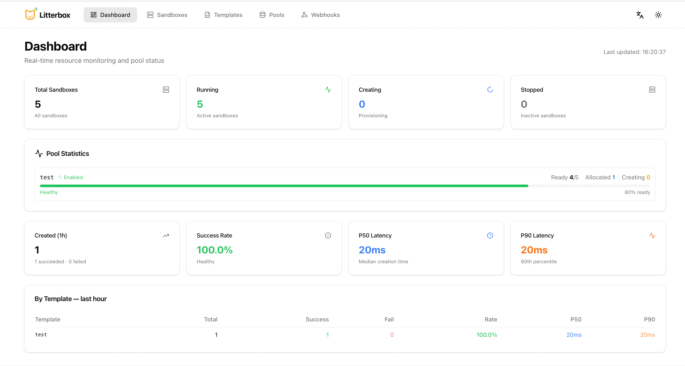
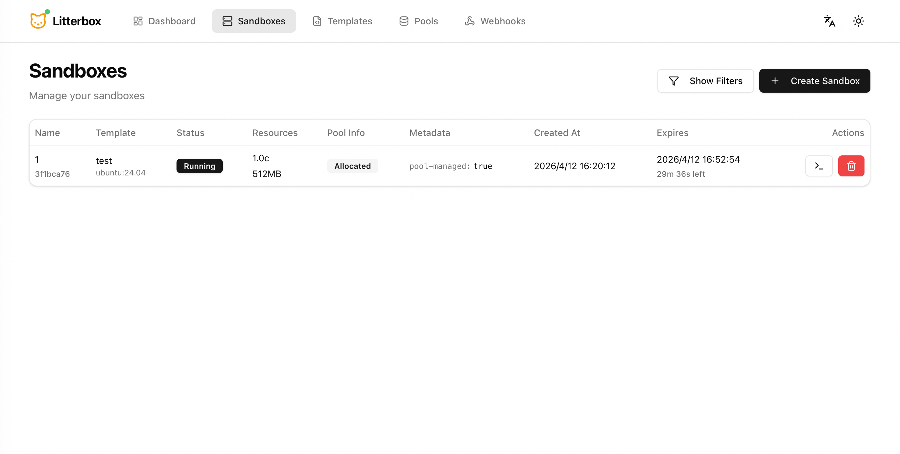
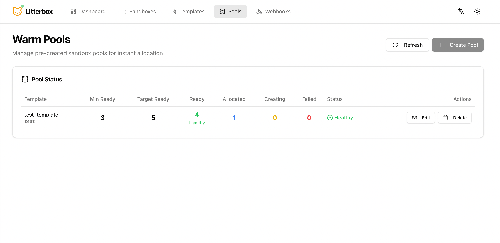
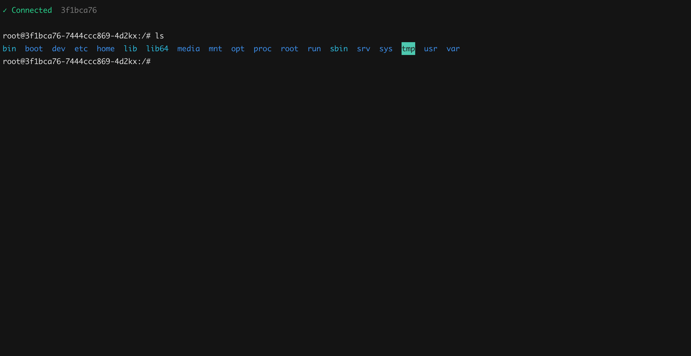

<div align="center">

# 🐱 Litterbox

**Secure sandbox orchestration platform, built for AI Agents.**

Kubernetes-native, REST API-driven. Runs untrusted code in VM-level isolated environments via Kata Containers.
<br>

[简体中文](README.zh.md) · [API Reference](docs/api-reference.md) · [Deploy Guide](docs/deployment.md) · [Configuration](docs/configuration.md)

</div>

<br>

## What is Litterbox?

Litterbox turns Kubernetes into a secure sandbox runtime. Define a template (image, resources, env), and Litterbox provisions isolated Pods, manages lifecycle, and exposes services on demand. Each sandbox runs in a VM with its own guest kernel — untrusted code or files cannot escape to the host or affect other workloads.

```text
POST /api/v1/sandboxes  →  running sandbox in < 200ms (warm pool)
                         →  browser terminal, file I/O, command exec
                         →  auto-deleted when TTL expires
```

<br>

## Core Capabilities

<table>
<tr>
<td width="140"><strong>Warm Pool</strong></td>
<td>Pre-boots sandboxes per template. Allocation latency as low as <strong>&lt; 50ms</strong>.</td>
</tr>
<tr>
<td><strong>Lifecycle</strong></td>
<td>Configurable TTL auto-destruction, or trigger sandbox deletion manually.</td>
</tr>
<tr>
<td><strong>Terminal</strong></td>
<td>WebSocket access to a live sandbox terminal.</td>
</tr>
<tr>
<td><strong>File System</strong></td>
<td>Read and write files inside a sandbox via REST API.</td>
</tr>
<tr>
<td><strong>Expose</strong></td>
<td>Expose any in-sandbox port to external network access.</td>
</tr>
<tr>
<td><strong>Webhooks</strong></td>
<td><code>sandbox_started</code> · <code>sandbox_ready</code> · <code>sandbox_deleted</code> events. Async delivery with configurable timeout and retry.</td>
</tr>
</table>

<br>

## Screenshots

<table>
<tr>
<td></td>
<td></td>
</tr>
<tr>
<td></td>
<td></td>
</tr>
</table>

<br>

## Architecture

```
                  ┌──────────┐         ┌──────────────────────────────────────┐
                  │Dashboard │  REST   │          Orchestrator API            │
                  │ (React)  ├────────▶│  FastAPI · uvicorn · WebSocket       │
                  └──────────┘   WS    │                                      │
                                       │  /templates  /sandboxes  /pools      │
  ┌──────────┐                         │  /webhooks   /exposes    /terminal   │
  │ External ├────────────────────────▶│                                      │
  └──────────┘          HTTP           └─────────────┬────────────────────────┘
                                                     │  K8s API
                                                     │  kubectl exec
       ┌─────────────────────────────────────────────┼──────────────────────┐
       │                                             ▼                      │
       │     ┌───────────┐  ┌───────────┐  ┌──────────────┐  ┌──────────┐  │
       │     │ Deployment│  │  Service   │  │   Ingress    │  │ConfigMap │  │
       │     │ (sandbox) │  │ (NodePort) │  │ (HTTP expose)│  │ (storage)│  │
       │     └───────────┘  └───────────┘  └──────────────┘  └──────────┘  │
       │                                                                    │
       │                        Kubernetes  Cluster                         │
       └─────────────────────────────────────────────▲──────────────────────┘
                                                     │
       ┌─────────────────────────────────────────────┴──────────────────────┐
       │                      Orchestrator Worker                           │
       │                                                                    │
       │    ┌──────────────┐  ┌──────────────┐  ┌────────────────────┐     │
       │    │Pool Reconcile│  │   Webhook    │  │    TTL Cleaner     │     │
       │    │  (Celery)    │  │   Delivery   │  │   (subprocess)     │     │
       │    └──────┬───────┘  └──────┬───────┘  └─────────┬──────────┘     │
       │           └─────────────────┴────────────────────┘                 │
       └─────────────────────────────────────┬──────────────────────────────┘
                                             │
                                      ┌──────┴──────┐
                                      │    Redis     │
                                      │              │
                                      │  Task Broker │
                                      │  TTL Sorted  │
                                      │  Set · Locks │
                                      └─────────────┘
```

### Prerequisites

| | Version |
|---|---|
| Kubernetes | `k3s recommended` |
| Docker Compose | `v2+` |
| Node.js | `18+` |
| Python | `3.12+` |

### 1. Start the Backend

```bash
cd orchestrator
cp .env.example .env      # → edit KUBECONFIG, K8S_NAMESPACE, BASE_DOMAIN
docker compose up --build
```

Verify:

```bash
curl http://localhost:8080/health
# {"success": true, "message": "Litterbox API is running"}
```

### 2. Start the Dashboard

```bash
cd dashboard
cp .env.example .env      # → set VITE_API_BASE_URL=http://localhost:8080
npm install && npm run dev
```

Open **http://localhost:5173**

### 3. Create Your First Sandbox

```bash
# 1. Create a template
curl -s -X POST http://localhost:8080/api/v1/templates \
  -H "Content-Type: application/json" \
  -d '{
    "name": "ubuntu",
    "image": "ubuntu:22.04",
    "command": "sleep infinity",
    "cpu_millicores": 500,
    "memory_mb": 512,
    "ttl_seconds": 3600
  }' | jq .data.id
# → "abc123"

# 2. Spin up a sandbox from the template
curl -s -X POST http://localhost:8080/api/v1/sandboxes \
  -H "Content-Type: application/json" \
  -d '{"template_id": "abc123"}' | jq .data.id
# → "xyz789"

# 3. Execute a command inside
curl -s -X POST http://localhost:8080/api/v1/sandboxes/xyz789/exec \
  -H "Content-Type: application/json" \
  -d '{"command": ["uname", "-a"]}' | jq .data.stdout
# → "Linux xyz789 5.15.0 ..."
```


## API

| Action | Method | Path |
|---|---|---|
| Create template | `POST` | `/api/v1/templates` |
| Create sandbox | `POST` | `/api/v1/sandboxes` |
| Execute command | `POST` | `/api/v1/sandboxes/:id/exec` |
| Read / write files | `GET` `PUT` | `/api/v1/sandboxes/:id/files` |
| Renew TTL | `POST` | `/api/v1/sandboxes/:id/renew` |
| Expose port | `POST` | `/api/v1/sandboxes/:id/exposes` |
| Create warm pool | `POST` | `/api/v1/pools/:template_id` |
| Register webhook | `POST` | `/api/v1/webhooks` |
| Interactive terminal | `WebSocket` | `/api/v1/sandboxes/:id/terminal` |

Each resource group supports full CRUD (`GET` / `PATCH` / `DELETE`).

> 📖 **Full API reference** → [docs/api-reference.md](docs/api-reference.md)

<br>

## Configuration

Backend is configured via `config.toml` with environment variable overrides (`ORCHESTRATOR__<SECTION>__<KEY>`).

| Variable | Default | Description |
|---|---|---|
| `ORCHESTRATOR__KUBERNETES__KUBECONFIG` | *empty (in-cluster)* | Path to kubeconfig; unset = in-cluster auth |
| `ORCHESTRATOR__KUBERNETES__NAMESPACE` | `default` | Namespace for sandbox resources |
| `ORCHESTRATOR__KUBERNETES__RUNTIME_CLASS` | *empty* | Pod runtimeClassName (e.g. `kata-cloud-hypervisor`) |
| `ORCHESTRATOR__SANDBOX__BASE_DOMAIN` | `runlet.cn` | Wildcard domain for HTTP exposes |
| `ORCHESTRATOR__SANDBOX__MAX_SANDBOXES` | `1000` | Max concurrent sandboxes |
| `ORCHESTRATOR__TTL__DEFAULT_TTL_SECONDS` | `1800` | Default sandbox lifetime (seconds) |
| `ORCHESTRATOR__CELERY__BROKER_URL` | `redis://127.0.0.1:6379/2` | Celery broker Redis URL |

> 📖 **Full configuration reference** → [docs/configuration.md](docs/configuration.md)

<br>

## Documentation

| | |
|---|---|
| [**ARCHITECTURE.md**](orchestrator/ARCHITECTURE.md) | Internal design, data flow, component boundaries |
| [**docs/api-reference.md**](docs/api-reference.md) | Full API reference |
| [**docs/configuration.md**](docs/configuration.md) | All configuration options |
| [**docs/development.md**](docs/development.md) | Local development |

<br>

---

## Contributing

Issues and pull requests are welcome. Please read [docs/development.md](docs/development.md) first.
