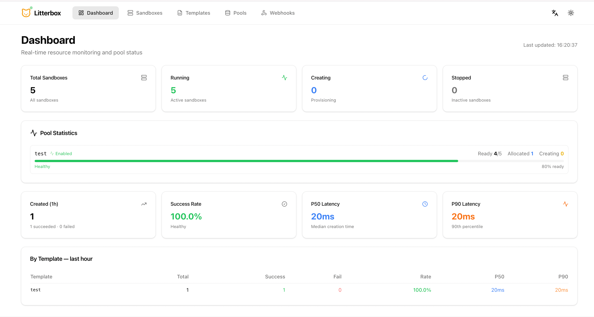
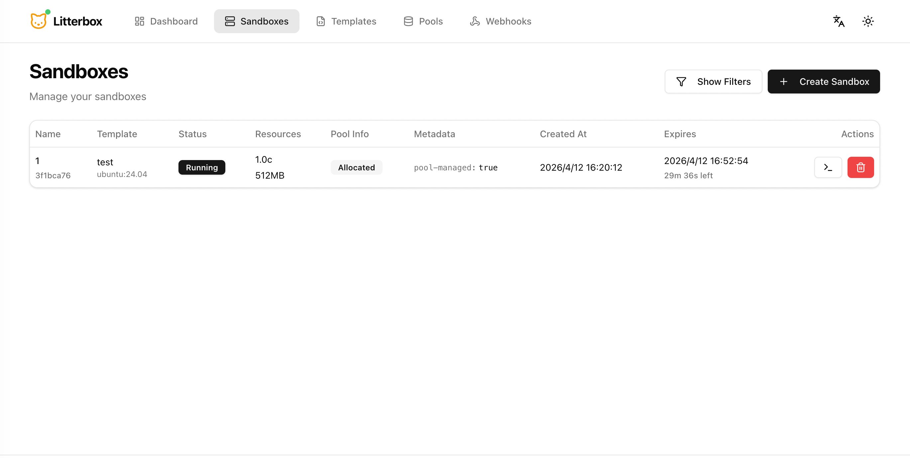
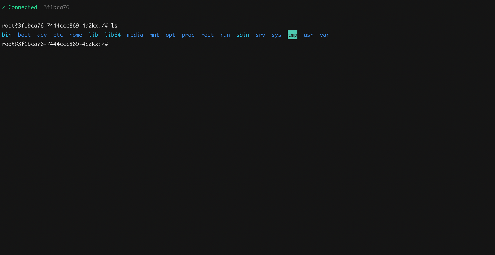
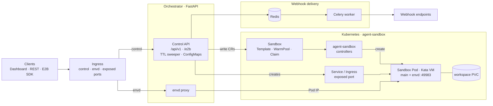

<div align="center">

# 🐱 Litterbox

**Secure sandbox orchestration for AI agents.**

Kubernetes-native. REST API and an E2B-compatible control plane. VM-level isolation with Kata Containers.
<br>

[简体中文](README.zh.md) · [API Reference](docs/api-reference.md) · [E2B Guide](orchestrator/docs/API.md) · [Configuration](docs/configuration.md)

</div>

<br>

## What is Litterbox?

Define a template, and Litterbox provisions an isolated sandbox on Kubernetes, manages its lifecycle, and exposes services on demand. Each sandbox runs in its own VM with a separate guest kernel, so untrusted code cannot reach the host or other workloads.

<br>

## Features

| Feature | Description |
|---|---|
| **VM isolation** | Sandboxes run under a Kata Containers RuntimeClass with their own guest kernel. |
| **Warm pool** | Pre-boots sandboxes per template for low-latency allocation. |
| **Workspace** | One persistent `/workspace` PVC per sandbox, retained across suspend and resume. |
| **E2B compatible** | Official E2B SDKs can create, connect, pause, resume and kill sandboxes. |
| **CRD lifecycle** | A `Sandbox` custom resource and controller: level-triggered reconciliation, informer-cached reads, self-healing Pods, controller-driven TTL. |
| **Lifecycle** | TTL auto-suspension, warm-pool reconciliation, sandbox lock, permanent delete. |
| **Terminal & files** | Command execution, file I/O and PTY sessions through the envd data plane. |
| **Expose** | Publish any sandbox port through a Service and Ingress. |
| **Webhooks** | Async `sandbox_started`, `sandbox_ready` and `sandbox_deleted` events. |

<br>

## Screenshots

<table>
<tr>
<td></td>
<td></td>
</tr>
<tr>
<td></td>
<td></td>
</tr>
</table>

<br>

## Architecture


```mermaid
%%{init: {"flowchart": {"curve": "stepBefore", "nodeSpacing": 40, "rankSpacing": 55}}}%%
flowchart LR
    Client["Clients<br/>Dashboard · REST · E2B SDK"]
    Ingress["Ingress<br/>control · envd · exposed ports"]

    subgraph Orchestrator["Orchestrator · FastAPI"]
        API["Control API<br/>/api/v1 · /e2b<br/>TTL sweeper · ConfigMaps"]
        Proxy["envd proxy"]
    end

    subgraph Async["Webhook delivery"]
        Redis[("Redis")]
        Worker["Celery worker"]
    end

    subgraph Cluster["Kubernetes · agent-sandbox"]
        CRs["Sandbox<br/>Template · WarmPool · Claim"]
        Ctrl["agent-sandbox<br/>controllers"]
        Svc["Service / Ingress<br/>exposed port"]
        Pod["Sandbox Pod · Kata VM<br/>main + envd :49983"]
        PVC[("workspace PVC")]
    end

    Hook["Webhook endpoints"]

    Client --> Ingress -->|"control"| API
    Ingress -->|"envd"| Proxy
    API --> Redis --> Worker --> Hook
    API -->|"write CRs"| CRs --> Ctrl -->|"create"| Pod
    API -->|"creates"| Svc --> Pod
    Proxy -->|"Pod IP"| Pod
    Pod --- PVC
```

- **Control plane.** `/api/v1` manages templates, pools, exposes, webhooks and sandbox lifecycle; `/e2b` exposes the same services to E2B clients. Template and webhook metadata live in ConfigMaps, and a sweeper in the API pauses sandboxes whose TTL expired.
- **Sandbox layer.** The API writes `SandboxTemplate`, `SandboxWarmPool` and `SandboxClaim` objects. Upstream [agent-sandbox](https://github.com/kubernetes-sigs/agent-sandbox) controllers create the Pod, the PVC and the warm pool. A claim adopts a warm sandbox when one is ready, otherwise it cold-starts one.
- **Exposure.** Ingress routes control and envd traffic to the orchestrator, and each exposed port gets a per-sandbox Service/Ingress that targets the running Pod.
- **Data plane.** Each sandbox runs envd on `49983`. The orchestrator authenticates and proxies terminal, file and process traffic to the Pod IP, either through `/api/v1/sandboxes/{id}/envd/*` or E2B host routing.
- **Isolation.** Sandboxes run in a Kata VM. `/workspace` is a per-sandbox PVC that survives pause and TTL expiry; template-level NetworkPolicy can restrict ingress and egress.

| Path | What happens |
|---|---|
| Create | `SandboxClaim` → warm adoption or cold start → PVC + Pod ready |
| Use | client → orchestrator proxy → `PodIP:49983` (envd) |
| Pause / TTL | `operatingMode=Suspended` → Pod deleted, PVC kept; resume reattaches it |

<br>

## Quick Start

| | Version |
|---|---|
| Kubernetes | k3s recommended |
| Python | 3.12+ |
| Node.js | 18+ |

### 1. Install the sandbox backend

Install [agent-sandbox](https://github.com/kubernetes-sigs/agent-sandbox) core plus extensions, then apply the orchestrator RBAC. See [agent-sandbox backend](orchestrator/deploy/AGENT_SANDBOX.md).

### 2. Start the backend

```bash
cd orchestrator
cp config.example.toml config.toml   # set kubeconfig / namespace if needed
uv sync
uv run uvicorn orchestrator.main:app --host 0.0.0.0 --port 8080
```

```bash
curl http://localhost:8080/health
# {"success": true, "message": "Litterbox API is running"}
```

> If `ORCHESTRATOR__AUTH__BEARER_TOKEN` is set, add `Authorization: Bearer <token>` to REST calls.
> Celery and Redis are only required for webhooks and warm pools.

### 3. Create a template

```bash
curl -s -X POST http://localhost:8080/api/v1/templates \
  -H "Content-Type: application/json" \
  -d '{
    "id": "ubuntu",
    "name": "ubuntu",
    "image": "ubuntu:22.04",
    "command": "sleep infinity",
    "cpu_millicores": 500,
    "memory_mb": 512,
    "ttl_seconds": 3600
  }'
```

### 4. Create a sandbox

```bash
pip install e2b
```

```python
from e2b import Sandbox

sandbox = Sandbox.create(
    template="ubuntu",
    api_url="http://localhost:8080/e2b",
    domain="localhost",
)
print(sandbox.sandbox_id)
```

Command execution and file access require envd; see [E2B Compatibility](#e2b-compatibility).

### 5. Start the dashboard

```bash
cd dashboard
npm install
npm run dev:local     # uses .env.local; defaults to http://127.0.0.1:8080
```

Open **http://localhost:5173**.

<br>

## E2B Compatibility

Litterbox implements a compatible subset of the E2B control plane and envd data plane, and can run the official E2B SDKs directly.

To use it:

- Set `ORCHESTRATOR__E2B__ENABLED=true` and an `ORCHESTRATOR__E2B__API_KEY` (empty falls back to the orchestrator bearer token).
- Point `ORCHESTRATOR__E2B__DOMAIN` at a wildcard domain whose DNS and TLS certificate route to the orchestrator.
- Install envd on the Kubernetes nodes and enable it with `ORCHESTRATOR__ENVD__ENABLED=true`.
- Litterbox does not implement E2B template build APIs. Define templates through `POST /api/v1/templates`; `Sandbox.create` selects an existing template.

See [Quick Start](#quick-start) for a runnable E2B SDK example.

| Capability | Status |
|---|---|
| `Sandbox.create` / `connect` / `kill` | Supported |
| `pause(keep_memory=False)` | Supported; keeps `/workspace` |
| `pause(keep_memory=True)` | Not supported (`409`) |
| `set_timeout` | Supported; `0` disables expiry |
| Commands, files, PTY | Supported through envd |

Not supported: memory snapshots (`pause(keep_memory=True)`), fork, E2B template build APIs, E2B volumes, and network allow/deny policies.

> The SDK context manager calls `kill()` on exit. Use `pause(keep_memory=False)` to keep the workspace.
>
> 📖 **Full E2B guide** → [orchestrator/docs/API.md](orchestrator/docs/API.md)

<br>

## API

| Group | Method | Path |
|---|---|---|
| Templates | `POST` / `GET` / `PATCH` / `DELETE` | `/api/v1/templates` |
| Sandboxes | `POST` / `GET` / `PATCH` / `DELETE` | `/api/v1/sandboxes` |
| Lifecycle | `POST` | `/api/v1/sandboxes/:id/suspend` · `resume` · `lock` · `unlock` · `renew` |
| Exposes | `POST` / `GET` / `DELETE` | `/api/v1/sandboxes/:id/exposes` |
| Pools | `POST` / `GET` / `PUT` / `DELETE` | `/api/v1/pools/:template_id` |
| Webhooks | `POST` / `GET` / `PATCH` / `DELETE` | `/api/v1/webhooks` |
| E2B control plane | `POST` / `GET` / `DELETE` | `/e2b/sandboxes` · `/e2b/sandboxes/:id` |
| E2B lifecycle | `POST` | `/e2b/sandboxes/:id/connect` · `pause` · `timeout` |
| envd path proxy | HTTP / Connect RPC | `/api/v1/sandboxes/:id/envd/*` |

> 📖 **Full API reference** → [docs/api-reference.md](docs/api-reference.md)

<br>

## Configuration

Configuration comes from `config.toml`, overridden by `ORCHESTRATOR__<SECTION>__<KEY>` environment variables.

| Variable | Default | Description |
|---|---|---|
| `ORCHESTRATOR__KUBERNETES__KUBECONFIG` | *empty (in-cluster)* | Path to kubeconfig |
| `ORCHESTRATOR__KUBERNETES__NAMESPACE` | `default` | Namespace for sandbox resources |
| `ORCHESTRATOR__KUBERNETES__RUNTIME_CLASS` | `kata-clh` | RuntimeClass for VM isolation, applied if it exists |
| `ORCHESTRATOR__WORKSPACE__STORAGE_CLASS` | `litterbox-workspace-lvm` | StorageClass for `/workspace` PVCs |
| `ORCHESTRATOR__ENVD__ENABLED` | `false` | Inject and start envd in sandbox pods |
| `ORCHESTRATOR__ENVD__VERSION` | `0.1.0` | envd version and node selector label |
| `ORCHESTRATOR__E2B__ENABLED` | `true` | Expose the E2B control plane |
| `ORCHESTRATOR__E2B__API_KEY` | *empty* | E2B `X-API-Key`; falls back to the bearer token |
| `ORCHESTRATOR__E2B__DOMAIN` | `sandbox.example.com` | Wildcard data-plane domain |
| `ORCHESTRATOR__SANDBOX__BASE_DOMAIN` | `example.com` | Wildcard domain for HTTP exposes |
| `ORCHESTRATOR__TTL__DEFAULT_TTL_SECONDS` | `1800` | Default sandbox lifetime |
| `ORCHESTRATOR__CELERY__BROKER_URL` | `redis://127.0.0.1:6379/2` | Celery broker URL |
| `ORCHESTRATOR__AUTH__BEARER_TOKEN` | *empty* | Optional bearer token for `/api/v1` |

> 📖 **Full configuration reference** → [docs/configuration.md](docs/configuration.md)

<br>

## Documentation

| | |
|---|---|
| [**ARCHITECTURE.md**](orchestrator/ARCHITECTURE.md) | Internal design, data flow, component boundaries |
| [**E2B API Guide**](orchestrator/docs/API.md) | E2B compatibility, SDK examples, raw endpoints |
| [**docs/api-reference.md**](docs/api-reference.md) | Full API reference |
| [**docs/configuration.md**](docs/configuration.md) | All configuration options |
| [**docs/development.md**](docs/development.md) | Local development |

<br>

---

## Contributing

Issues and pull requests are welcome. Please read [docs/development.md](docs/development.md) first.
