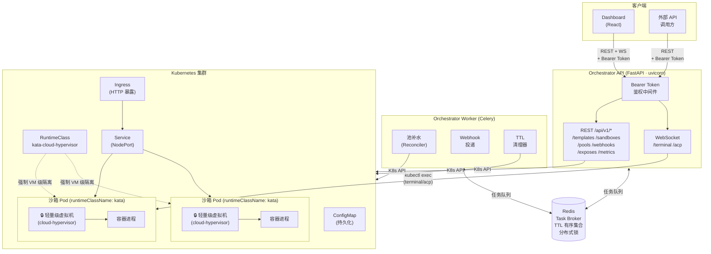

<div align="center">

# 🐱 Litterbox

**为 AI Agent 设计的安全沙箱编排平台。**

基于 Kubernetes，通过 REST API 动态创建与管理不可信代码执行环境，并结合 Kata Containers 实现虚拟机级别的内核隔离。
<br>

[English](README.md) · [API 文档](docs/api-reference.md) · [部署指南](docs/deployment.md) · [配置说明](docs/configuration.md)

</div>

<br>

## Litterbox 是什么？

Litterbox 将 Kubernetes 变为安全的沙箱运行环境。用户只需定义模板（镜像、资源、环境变量），Litterbox 便会自动创建隔离 Pod、管理生命周期并按需暴露服务。每个沙箱均运行在具备独立 Guest 环境的虚拟机中，确保不可信代码或文件无法影响宿主机或其他工作负载。

```text
POST /api/v1/sandboxes  →  < 200ms 拿到运行中的沙箱（预热池）
                         →  浏览器终端、文件读写、命令执行
                         →  TTL 自动销毁 / 主动销毁
```

<br>

## 核心能力

<table>
<tr>
<td width="140"><strong>沙箱池化</strong></td>
<td>按模板预启动沙箱。分配延迟可低至<strong>< 50ms</strong></td>
</tr>
<tr>
<td><strong>生命周期</strong></td>
<td>可配置沙箱TTL自动销毁，也可主动触发沙箱销毁。</td>
</tr>
<tr>
<td><strong>交互式终端</strong></td>
<td>支持 WebSocket 访问沙箱终端。</td>
</tr>
<tr>
<td><strong>文件系统</strong></td>
<td>通过 REST API读写沙箱内的文件。</td>
</tr>
<tr>
<td><strong>服务暴露</strong></td>
<td>可暴露沙箱内的任意端口服务到外部网络访问。</td>
</tr>
<tr>
<td><strong>Webhook</strong></td>
<td>支持<code>sandbox_started</code> · <code>sandbox_ready</code> · <code>sandbox_deleted</code> 事件。异步投递，可配置超时/重试。</td>
</tr>
</table>

<br>

## 截图

<table>
<tr>
<td></td>
<td></td>
</tr>
<tr>
<td></td>
<td></td>
</tr>
</table>

<br>

##  架构



### 前置条件

| | 版本         |
|---|------------|
| Kubernetes | `推荐使用 k3s` |
| Docker Compose | `v2+`      |
| Node.js | `18+`      |
| Python  | `3.12+`    |

### 1、 启动后端

```bash
cd orchestrator
cp .env.example .env      # → 编辑 KUBECONFIG、K8S_NAMESPACE、BASE_DOMAIN
docker compose up --build
```

验证：

```bash
curl http://localhost:8080/health
# {"success": true, "message": "Litterbox API is running"}
```

### 2、启动控制台

```bash
cd dashboard
cp .env.example .env      # → 设置 VITE_API_BASE_URL 和 VITE_API_BEARER_TOKEN
npm install && npm run dev
```

访问 **http://localhost:5173**

> **鉴权：** 若后端配置了 `ORCHESTRATOR__AUTH__BEARER_TOKEN`，需在 `dashboard/.env` 中将 `VITE_API_BEARER_TOKEN` 设为相同的值。留空则不启用鉴权。

### 3️⃣ 创建第一个沙箱

```bash
# 1. 创建模板
curl -s -X POST http://localhost:8080/api/v1/templates \
  -H "Content-Type: application/json" \
  -d '{
    "name": "ubuntu",
    "image": "ubuntu:22.04",
    "command": "sleep infinity",
    "cpu_millicores": 500,
    "memory_mb": 512,
    "ttl_seconds": 3600
  }' | jq .data.id
# → "abc123"

# 2. 基于模板创建沙箱
curl -s -X POST http://localhost:8080/api/v1/sandboxes \
  -H "Content-Type: application/json" \
  -d '{"template_id": "abc123"}' | jq .data.id
# → "xyz789"

# 3. 在沙箱内执行命令
curl -s -X POST http://localhost:8080/api/v1/sandboxes/xyz789/exec \
  -H "Content-Type: application/json" \
  -d '{"command": ["uname", "-a"]}' | jq .data.stdout
# → "Linux xyz789 5.15.0 ..."
```


## 文档

| |               |
|---|---------------|
| [**ARCHITECTURE.md**](orchestrator/ARCHITECTURE.md) | 内部设计、数据流、组件边界 |
| [**docs/api-reference.md**](docs/api-reference.md) | API接口文档       |
| [**docs/configuration.md**](docs/configuration.md) | 配置项说明         |
| [**docs/development.md**](docs/development.md) | 本地开发          |

<br>

---

## 贡献

欢迎提交 Issue 和 Pull Request，请先阅读 [docs/development.md](docs/development.md)。

