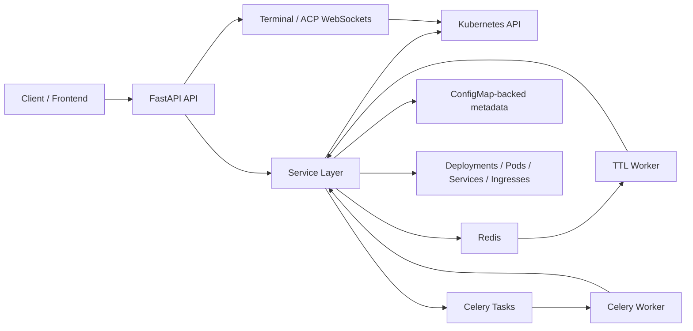

# Litterbox Orchestrator Architecture

## Overview

`orchestrator` is the Python 3.12 backend for the Litterbox sandbox platform. It exposes a FastAPI control plane, uses Celery for asynchronous work, talks to Kubernetes through the official Python SDK, and uses Redis for both task transport and lightweight coordination.

At a high level, the service manages five things:

1. Template definitions for sandbox images and resource limits
2. Sandbox lifecycle on Kubernetes
3. Warm pool management for pre-created sandboxes
4. Webhook delivery for sandbox events
5. In-sandbox workspace access, terminal sessions, and file operations

The codebase is intentionally small and mostly layered:

- `main.py` is the HTTP/WebSocket transport layer
- `container.py` wires concrete implementations together
- `services/` contains business orchestration
- `infra/` wraps Kubernetes and Redis-backed persistence primitives
- `domain/models.py` defines the API and internal data contracts

## Runtime Topology

The project runs in two primary process roles plus one helper loop:

- `api`: FastAPI + Uvicorn
- `worker`: Celery worker for pool reconciliation and webhook delivery
- `ttl`: a long-running polling loop that deletes expired sandboxes

In Docker Compose, the `worker` container starts both the Celery worker and the TTL worker subprocess. In local development they can also be run separately.



## External Dependencies

- Kubernetes:
  stores and runs the actual sandbox workloads
- Redis:
  Celery broker/result backend, TTL sorted-set queue, and pool locking
- HTTP webhook endpoints:
  external consumers of sandbox lifecycle events
- Prometheus:
  scrapes `/metrics`

The orchestrator does not use a relational database. Persistent control-plane data is stored in Kubernetes `ConfigMap`s.

## Layering And Responsibilities

### 1. Transport Layer

`src/orchestrator/main.py` exposes:

- REST endpoints for templates, sandboxes, pools, exposes, webhooks, TTL, and metrics
- WebSocket endpoints for interactive shell access and ACP proxying
- process-local FastAPI lifespan bootstrapping

This layer is thin by design. It mainly:

- validates query/body parameters via Pydantic models
- translates exceptions to JSON API responses
- forwards work to services from the dependency container

### 2. Dependency Wiring

`src/orchestrator/container.py` constructs the application object graph:

- one `KubernetesGateway`
- three ConfigMap repositories: template, pool, webhook
- one Redis-backed `TTLQueueRepository`
- services built on top of those primitives

This file is the single composition root for both the API process and worker processes.

### 3. Domain Models

`src/orchestrator/domain/models.py` defines the contracts for:

- template CRUD
- pool configuration and status
- sandbox state and list/query responses
- expose records
- webhook payloads
- workspace file/exec operations
- generic API envelope responses

The code uses the same Pydantic models for both API IO and most service boundaries, so the domain file is the canonical schema reference.

### 4. Service Layer

The service layer is where nearly all business behavior lives.

#### `TemplateService`

- creates, lists, updates, deletes template metadata
- persists templates through `TemplateRepository`

#### `SandboxService`

Owns the lifecycle of sandbox deployments:

- build deployment specs from templates
- create/read/list/update/delete sandboxes
- scale stop/start/restart workloads
- map Kubernetes state to `SandboxStatus`
- manage TTL annotations and Redis TTL scheduling
- dispatch sandbox lifecycle webhooks

This is the central domain service in the project.

#### `PoolService`

Implements warm-pool behavior on top of `SandboxService`:

- create/update/delete pool definitions
- allocate from `AVAILABLE` sandboxes when possible
- fall back to direct creation when the pool is empty
- reconcile toward `target_ready`
- clean up failed or excess warm sandboxes
- use Redis locks to avoid concurrent claim/reconcile races

#### `ServiceExposeService`

Creates per-sandbox network exposure resources:

- HTTP exposure -> `Service` + `Ingress`
- TCP exposure -> `NodePort Service`

#### `WebhookService`

- CRUD for webhook subscriptions
- synchronous delivery logic with retries and masked auth logging

#### `WebhookDispatcher`

- selects subscribed hooks for an event
- submits Celery jobs for asynchronous delivery

#### `WorkspaceService`

Provides a filesystem and command API into the running sandbox:

- exec arbitrary commands
- read files
- list directories
- build directory trees
- write files/directories
- delete files/directories

This service is implemented by shelling into the sandbox container through Kubernetes exec sessions.

#### `TTLWorker`

- polls Redis for expired TTL entries
- asks `SandboxService` to delete the sandbox if the TTL token still matches

The token check is important because TTL renewal rotates tokens and invalidates stale scheduled entries.

### 5. Infrastructure Layer

#### `KubernetesGateway`

Encapsulates direct Kubernetes API usage:

- ConfigMap CRUD
- Deployment CRUD/patch/scale/list
- Pod listing, deletion, readiness polling
- exec/shell/ACP streams
- Service and Ingress CRUD
- node inspection for TCP exposure IP selection
- optional runtime class and image pull secret detection

This class is intentionally imperative and fairly low level. It is the boundary between business code and Kubernetes objects.

#### Repositories

`src/orchestrator/infra/repositories.py` implements three ConfigMap-backed repositories:

- `TemplateRepository`
- `PoolRepository`
- `WebhookRepository`

Patterns:

- each entity type gets its own name prefix and payload key
- payloads are stored as JSON strings in ConfigMaps
- labels are used for selection
- selected timestamps are reconstructed from ConfigMap metadata/annotations

#### `TTLQueueRepository`

Uses a Redis sorted set:

- score = expiration timestamp
- member = JSON of `sandbox_id` + `ttl_token`
- Lua script atomically pops the earliest due item

## Persistence Model

The project spreads state across Kubernetes and Redis:

### Kubernetes

- `ConfigMap`
  template, pool, and webhook definitions
- `Deployment`
  one sandbox per deployment
- `Pod`
  runtime backing each sandbox deployment
- `Service`
  per-expose service objects
- `Ingress`
  HTTP exposure routing

Most sandbox metadata is stored in deployment labels and annotations, not in an external database.

### Redis

- Celery broker/result backend
- pool reconcile lock keys
- pool claim lock keys
- TTL schedule sorted set

## Core Flows

### Template Lifecycle

```text
HTTP request
-> TemplateService
-> TemplateRepository
-> Kubernetes ConfigMap
```

Templates define image, command, env, CPU/memory limits, optional host-path mounts, optional TTL defaults, and user metadata.

### Direct Sandbox Allocation

```text
POST /sandboxes
-> PoolService.allocate_sandbox()
-> no reusable warm sandbox
-> SandboxService.create_sandbox()
-> Kubernetes Deployment created
-> wait for ready pod
-> SANDBOX_STARTED + SANDBOX_READY dispatched
-> response returned
```

`SandboxService` converts a template into a `Deployment` with:

- one container named `main`
- CPU/memory limits and requests
- optional runtime class
- optional image pull secret
- optional host-path volume mounts
- labels/annotations carrying logical metadata

### Warm Pool Allocation

```text
POST /sandboxes
-> PoolService.allocate_sandbox()
-> Redis claim lock
-> find AVAILABLE sandbox
-> mark ALLOCATED + attach user metadata + TTL
-> release lock
-> dispatch running/ready events
-> maybe enqueue reconcile
```

If no reusable sandbox is available, the same endpoint falls back to direct creation.

### Pool Reconciliation

```text
pool create/update/low-watermark
-> Celery task reconcile_pool
-> PoolService._reconcile_create()
-> create CREATING sandboxes without waiting
-> wait in parallel for readiness
-> mark AVAILABLE
-> clean FAILED sandboxes
-> delete excess AVAILABLE sandboxes above target
```

Important implementation details:

- reconcile and claim paths use separate Redis locks
- newly created warm sandboxes are created with `ttl_seconds=0`
- once allocated to a user, pool sandboxes inherit template/default TTL

### TTL Expiration

```text
sandbox created or TTL updated
-> SandboxService writes ttl annotations
-> TTLQueueRepository schedules Redis sorted-set entry
-> TTL worker pops due entry
-> SandboxService.delete_if_ttl_due()
-> compare ttl token
-> delete only if token still current and expiry actually passed
```

This prevents old TTL events from deleting a sandbox after a renewal.

### Webhook Delivery

```text
Sandbox event
-> WebhookDispatcher
-> select matching hooks by user_id/event/template
-> enqueue Celery delivery tasks
-> WebhookService.deliver()
-> httpx POST with retry policy
```

Webhook events currently supported:

- `sandbox_started`
- `sandbox_ready`
- `sandbox_deleted`

### Workspace And Terminal Access

There are two access modes:

- REST file/exec API via `WorkspaceService`
- interactive WebSockets for `/terminal` and `/acp`

`WorkspaceService` works by generating shell scripts and running them through Kubernetes exec. It uses a stderr exit marker to recover the true command exit code even though the exec API itself mainly provides stdout/stderr streams.

## API Surface Summary

Main resource groups:

- `/api/v1/templates`
- `/api/v1/sandboxes`
- `/api/v1/pools`
- `/api/v1/exposes`
- `/api/v1/webhooks`
- `/api/v1/metrics/snapshot`
- `/api/v1/sandboxes/{id}/terminal`
- `/api/v1/sandboxes/{id}/acp`

The HTTP response contract is mostly wrapped in a generic `ApiResponse { success, message, data, error }`.

## Configuration Model

Configuration is loaded from `config.toml` and then overridden by environment variables with the prefix `ORCHESTRATOR__`.

Example override shape:

```text
ORCHESTRATOR__KUBERNETES__NAMESPACE=default
ORCHESTRATOR__CELERY__BROKER_URL=redis://redis:6379/2
```

Defined config groups:

- `server`
- `kubernetes`
- `sandbox`
- `ttl`
- `webhook`
- `celery`

Notable behavior:

- relative `kubeconfig` paths are resolved against the repository root
- if no kubeconfig is configured, the gateway tries in-cluster config first
- runtime class is used only if it actually exists in the cluster
- image pull secret is used only if it exists in the namespace

## Observability

Two metric surfaces exist:

- `/metrics`
  Prometheus exposition from `prometheus_client`
- `/api/v1/metrics/snapshot`
  JSON snapshot for dashboard polling

The metrics implementation tracks:

- sandbox create duration histogram
- sandbox create totals
- in-memory one-hour create event window
- per-template stats
- last-hour minute buckets
- live running/stopped/creating counts injected at request time

## Testing Strategy

The project currently has:

- focused unit tests for Kubernetes exec client isolation
- focused unit tests for webhook logging and auth masking
- a broad integration test that exercises the FastAPI app, Celery workers, TTL worker, pool flows, file APIs, webhooks, exposes, metrics, and terminal websocket behavior

The integration test uses real subprocesses for Celery and the TTL worker, so it validates the orchestration shape rather than only pure functions.

## Design Choices

### Why ConfigMaps Instead Of A Database

The control plane persists relatively small metadata objects that are already tightly coupled to Kubernetes resources. ConfigMaps keep the operational footprint small and avoid introducing a second state system for templates, pools, and webhooks.

### Why One Deployment Per Sandbox

A deployment gives easy scaling to zero/one, restart semantics, label/annotation metadata, and standard pod management through the Kubernetes API.

### Why Redis For More Than Celery

Redis is already required for Celery, so it is also reused for:

- TTL scheduling
- simple distributed locks for pool operations

That keeps the coordination story operationally simple.

## Current Limitations And Gaps

These are visible in the current code and matter for maintainers:

- `sandbox.max_sandboxes`, `ttl.min_ttl_seconds`, `ttl.max_ttl_seconds`, and `kubernetes.storage_class` are configured but not meaningfully enforced/used in service logic today.
- API error handling is mostly broad `except Exception` -> `500`, which keeps handlers short but loses structured failure typing.
- The service stores significant operational state in labels/annotations; changing annotation keys is therefore a migration concern.
- Pool reconciliation depends on Redis locks and periodic task delivery rather than a stronger transactional model.
- The workspace API shells into containers and assumes basic Unix utilities such as `sh`, `find`, `base64`, and standard filesystem semantics inside the sandbox image.

## File Map

- `src/orchestrator/main.py`
  HTTP and WebSocket entrypoints
- `src/orchestrator/container.py`
  dependency graph construction
- `src/orchestrator/config.py`
  config loading and environment overrides
- `src/orchestrator/domain/models.py`
  schema and response models
- `src/orchestrator/services/sandboxes.py`
  sandbox lifecycle orchestration
- `src/orchestrator/services/pools.py`
  warm pool allocation and reconciliation
- `src/orchestrator/services/workspace.py`
  exec and file operations inside sandboxes
- `src/orchestrator/services/webhooks.py`
  webhook CRUD, dispatch, and delivery
- `src/orchestrator/services/exposes.py`
  service/ingress exposure
- `src/orchestrator/services/ttl.py`
  TTL worker loop
- `src/orchestrator/services/metrics.py`
  Prometheus and JSON snapshot metrics
- `src/orchestrator/infra/kubernetes.py`
  Kubernetes API boundary
- `src/orchestrator/infra/repositories.py`
  ConfigMap-backed persistence
- `src/orchestrator/infra/ttl_queue.py`
  Redis TTL scheduling
- `src/orchestrator/tasks.py`
  Celery task entrypoints
- `src/orchestrator/worker_runner.py`
  standalone TTL worker bootstrap

## Mental Model For Maintainers

If you need to reason about the system quickly, use this order:

1. `main.py` tells you the public surface.
2. `container.py` tells you what concrete objects exist.
3. `services/sandboxes.py` and `services/pools.py` tell you the main lifecycle rules.
4. `infra/kubernetes.py` tells you what actually happens in the cluster.
5. `tests/integration/test_api.py` shows the end-to-end contract the code is expected to preserve.
