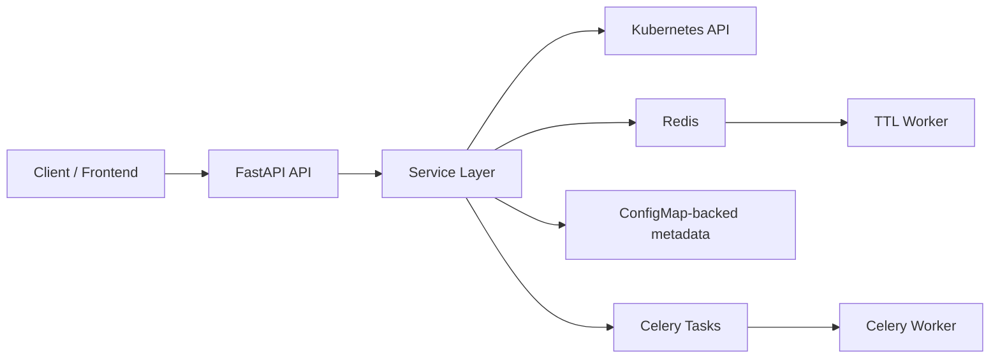

# Litterbox Orchestrator

[简体中文](README.zh.md)

Litterbox Orchestrator is a Python 3.12 control plane for provisioning and managing ephemeral sandboxes on Kubernetes.

It combines FastAPI, Celery, Redis, and the Kubernetes Python SDK to provide:

- template-based sandbox provisioning
- optional warm pools for low-latency allocation
- sandbox TTL and automatic cleanup
- in-sandbox command execution, file access, and terminal streaming
- HTTP/TCP exposure for sandbox services
- webhook notifications for sandbox lifecycle events
- Prometheus metrics and a JSON metrics snapshot endpoint

Unlike many sandbox managers, it does not require a separate database. Templates, pool definitions, and webhook subscriptions are stored as Kubernetes `ConfigMap`s, while Redis is used for task transport, pool coordination, and TTL scheduling.

## Overview

This project is designed for workloads that need short-lived, isolated execution environments with an API-first control plane.

Typical use cases include:

- ephemeral developer environments
- code execution sandboxes
- browser-based terminals backed by Kubernetes pods
- agent or automation workloads that need disposable workspaces
- internal platforms that need webhook-driven sandbox lifecycle events

## Highlights

- `TemplateService`: define reusable sandbox blueprints with image, command, env vars, CPU, memory, mounts, metadata, and default TTL
- `SandboxService`: create, start, stop, restart, inspect, update, and delete sandbox deployments
- `PoolService`: keep prewarmed sandboxes ready and allocate from the pool when possible
- `WorkspaceService`: execute commands, browse files, upload files, and delete files inside running sandboxes
- `ServiceExposeService`: expose sandbox ports over HTTP via `Ingress` or over TCP via `NodePort`
- `WebhookService`: register subscriptions and deliver `sandbox_started`, `sandbox_ready`, and `sandbox_deleted` events
- `TTLWorker`: delete expired sandboxes safely using token-based TTL invalidation

## Architecture

High-level runtime topology:



Main runtime roles:

- `api`: serves REST and WebSocket endpoints
- `worker`: runs Celery tasks for webhook delivery and pool reconciliation
- `ttl`: polls Redis and deletes expired sandboxes

For a deeper design walkthrough, see [ARCHITECTURE.md](ARCHITECTURE.md).

## Tech Stack

| Component | Purpose |
| --- | --- |
| FastAPI | REST API and WebSocket endpoints |
| Celery | asynchronous jobs |
| Redis | broker, result backend, TTL queue, and pool locks |
| Kubernetes Python SDK | cluster resource management and exec streaming |
| Prometheus client | `/metrics` exposition |
| Pydantic | request, response, and config modeling |

## Repository Layout

```text
src/orchestrator/
  main.py             FastAPI entrypoints
  container.py        dependency wiring
  config.py           config loading and env overrides
  tasks.py            Celery task entrypoints
  worker_runner.py    standalone TTL worker
  domain/models.py    API and domain models
  services/           business logic
  infra/              Kubernetes and Redis adapters
tests/
  integration/        end-to-end API and worker flows
docker-compose.yml    local multi-process setup
config.toml           default configuration
```

## Requirements

Minimum requirements:

- Python `3.12+`
- Redis `7+`
- Kubernetes cluster reachable via `kubeconfig` or in-cluster auth
- Docker and Docker Compose for the simplest local setup

Recommended for local development:

- `k3s` or `kind`
- `kubectl`
- an ingress controller if you want HTTP service exposure to work end-to-end

## Quick Start With Docker Compose

### 1. Configure the environment

```bash
cp .env.example .env
```

Edit `.env` as needed:

```dotenv
KUBECONFIG=~/.kube/config
K8S_NAMESPACE=default
API_PORT=8080
BASE_DOMAIN=localhost
```

### 2. Start the stack

```bash
docker compose up --build
```

This starts:

- `redis`
- `api`
- `worker`

The `worker` container runs both the Celery worker and the TTL worker subprocess.

### 3. Verify the API

```bash
curl http://localhost:8080/health
```

Expected response:

```json
{
  "success": true,
  "message": "Litterbox API is running"
}
```

### 4. Create a template

```bash
curl -X POST http://localhost:8080/api/v1/templates \
  -H "Content-Type: application/json" \
  -d '{
    "name": "ubuntu-dev",
    "image": "ubuntu:22.04",
    "command": "sleep 3600",
    "cpu_millicores": 500,
    "memory_mb": 512,
    "ttl_seconds": 3600
  }'
```

### 5. Create a sandbox

`POST /api/v1/sandboxes` is the primary allocation endpoint. If a pool exists for the template, the request may be fulfilled from the warm pool; otherwise a new sandbox is created.

```bash
curl -X POST http://localhost:8080/api/v1/sandboxes \
  -H "Content-Type: application/json" \
  -d '{
    "template_id": "<template-id>",
    "name": "my-sandbox",
    "metadata": {
      "user_id": "demo-user",
      "project_id": "demo-project"
    }
  }'
```

### 6. Execute a command inside the sandbox

```bash
curl -X POST http://localhost:8080/api/v1/sandboxes/<sandbox-id>/exec \
  -H "Content-Type: application/json" \
  -d '{
    "command": ["echo", "hello from sandbox"],
    "timeout": 10
  }'
```

## Run From Source

Create a virtual environment and install the project:

```bash
python3 -m venv .venv
source .venv/bin/activate
pip install -e ".[dev]"
```

Run the API:

```bash
uvicorn orchestrator.main:app --reload --port 8080
```

Run the Celery worker in a separate terminal:

```bash
celery -A orchestrator.celery_app:celery_app worker -l info -Q pool_reconcile,webhook_delivery
```

Run the TTL worker in another terminal:

```bash
python3 -m orchestrator.worker_runner ttl
```

## Configuration

Configuration is loaded from `config.toml` and can be overridden with environment variables prefixed with `ORCHESTRATOR__`.

Examples:

```bash
export ORCHESTRATOR__KUBERNETES__NAMESPACE=default
export ORCHESTRATOR__CELERY__BROKER_URL=redis://127.0.0.1:6379/2
export ORCHESTRATOR__SANDBOX__BASE_DOMAIN=localhost
```

Config groups:

- `server`
- `kubernetes`
- `sandbox`
- `ttl`
- `webhook`
- `celery`

Notable fields in the default config:

- `kubernetes.kubeconfig`
- `kubernetes.namespace`
- `kubernetes.runtime_class`
- `kubernetes.image_pull_secret`
- `sandbox.base_domain`
- `ttl.default_ttl_seconds`
- `celery.broker_url`

## API Surface

Main endpoint groups:

- `GET /health`
- `/api/v1/templates`
- `/api/v1/sandboxes`
- `/api/v1/pools`
- `/api/v1/exposes`
- `/api/v1/webhooks`
- `GET /api/v1/metrics/snapshot`
- `WS /api/v1/sandboxes/{sandbox_id}/terminal`
- `WS /api/v1/sandboxes/{sandbox_id}/acp`

Capability summary:

- template CRUD
- sandbox lifecycle management
- file read/write/delete and command execution
- TTL inspection, update, and renewal
- pool configuration and status inspection
- service exposure creation and deletion
- webhook CRUD and asynchronous delivery
- Prometheus and JSON metrics endpoints

## Testing

Run the test suite with:

```bash
pytest
```

The current test coverage includes:

- end-to-end API flows
- webhook delivery behavior
- warm pool allocation
- TTL renewal and expiration behavior
- terminal websocket interaction
- Kubernetes exec client isolation

## Known Limitations

The current open-source code has a few notable limitations:

- some config fields are defined but not fully enforced in service logic yet, such as `sandbox.max_sandboxes` and TTL min/max bounds
- metadata is persisted in Kubernetes labels and annotations, so changing metadata key conventions is a compatibility concern

## Contributing

Issues and pull requests are welcome.

When contributing:

- keep diffs small and reviewable
- preserve the API behavior covered by integration tests
- prefer reusing existing service and repository patterns
- run `pytest` before sending changes

## Open Source Release Checklist

Before publishing this repository, you will likely want to confirm:

- license file is present
- repository description and topics are set
- container image references and example domains are updated
- cluster-specific secrets or kubeconfig paths are removed from examples if needed
