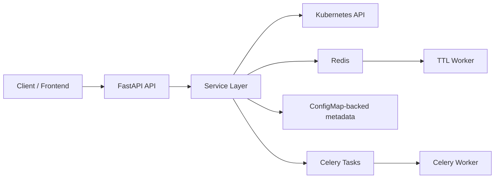

# Litterbox Orchestrator

[English](README.md)

Litterbox Orchestrator 是一个基于 Python 3.12 的 Kubernetes 沙箱控制平面，用来创建、管理和回收短生命周期的运行环境。

它组合了 FastAPI、Celery、Redis 和 Kubernetes Python SDK，提供：

- 基于模板的沙箱创建
- 低延迟预热池分配
- TTL 过期与自动清理
- 沙箱内命令执行、文件访问和终端流式连接
- HTTP/TCP 服务暴露
- 沙箱生命周期 Webhook 通知
- Prometheus 指标与 JSON 快照指标接口

和很多同类系统不同，这个项目不依赖单独的数据库。模板、池配置和 Webhook 订阅存储在 Kubernetes `ConfigMap` 中，Redis 负责任务传输、池协调和 TTL 调度。

## 项目概览

这个项目适合需要“短生命周期、隔离执行环境、API 驱动控制平面”的场景。

典型用途包括：

- 临时开发环境
- 代码执行沙箱
- 浏览器终端背后的 Kubernetes Pod
- 需要一次性工作区的 agent 或自动化任务
- 需要通过 Webhook 感知沙箱生命周期的内部平台

## 核心能力

- `TemplateService`：定义镜像、命令、环境变量、CPU、内存、挂载、元数据和默认 TTL
- `SandboxService`：创建、启动、停止、重启、查询、更新和删除沙箱
- `PoolService`：维护预热沙箱池，并在可能时直接从池中分配
- `WorkspaceService`：在运行中的沙箱内执行命令、浏览文件、上传文件和删除文件
- `ServiceExposeService`：通过 `Ingress` 暴露 HTTP 服务，或通过 `NodePort` 暴露 TCP 服务
- `WebhookService`：注册订阅并投递 `sandbox_started`、`sandbox_ready`、`sandbox_deleted` 事件
- `TTLWorker`：基于 TTL token 安全删除过期沙箱

## 架构

运行时拓扑概览：



主要运行角色：

- `api`：提供 REST 和 WebSocket 接口
- `worker`：执行 Webhook 投递和池补水的 Celery 任务
- `ttl`：轮询 Redis 并删除过期沙箱

更完整的设计说明见 [ARCHITECTURE.md](ARCHITECTURE.md)。

## 技术栈

| 组件 | 作用 |
| --- | --- |
| FastAPI | REST API 和 WebSocket 接口 |
| Celery | 异步任务 |
| Redis | Broker、结果后端、TTL 队列和池锁 |
| Kubernetes Python SDK | 集群资源管理和 exec 流式连接 |
| Prometheus client | `/metrics` 指标输出 |
| Pydantic | 请求、响应和配置建模 |

## 目录结构

```text
src/orchestrator/
  main.py             FastAPI 入口
  container.py        依赖装配
  config.py           配置加载和环境变量覆盖
  tasks.py            Celery 任务入口
  worker_runner.py    独立 TTL worker
  domain/models.py    API 和领域模型
  services/           业务逻辑
  infra/              Kubernetes 和 Redis 适配层
tests/
  integration/        端到端 API 和 worker 流程
docker-compose.yml    本地多进程启动配置
config.toml           默认配置
```

## 环境要求

最低要求：

- Python `3.12+`
- Redis `7+`
- 可通过 `kubeconfig` 或集群内鉴权访问的 Kubernetes 集群
- Docker 和 Docker Compose，用于最简单的本地启动

本地开发推荐：

- `k3s` 或 `kind`
- `kubectl`
- 如果要完整验证 HTTP 暴露链路，建议准备 Ingress Controller

## 用 Docker Compose 快速启动

### 1. 配置环境变量

```bash
cp .env.example .env
```

按需编辑 `.env`：

```dotenv
KUBECONFIG=~/.kube/config
K8S_NAMESPACE=default
API_PORT=8080
BASE_DOMAIN=localhost
```

### 2. 启动服务

```bash
docker compose up --build
```

会启动：

- `redis`
- `api`
- `worker`

其中 `worker` 容器内部会同时启动 Celery worker 和 TTL worker 子进程。

### 3. 检查服务健康状态

```bash
curl http://localhost:8080/health
```

预期返回：

```json
{
  "success": true,
  "message": "Litterbox API is running"
}
```

### 4. 创建模板

```bash
curl -X POST http://localhost:8080/api/v1/templates \
  -H "Content-Type: application/json" \
  -d '{
    "name": "ubuntu-dev",
    "image": "ubuntu:22.04",
    "command": "sleep 3600",
    "cpu_millicores": 500,
    "memory_mb": 512,
    "ttl_seconds": 3600
  }'
```

### 5. 创建沙箱

`POST /api/v1/sandboxes` 是主要分配入口。如果该模板配置了预热池，请求会优先从池中拿可用沙箱；否则会直接新建。

```bash
curl -X POST http://localhost:8080/api/v1/sandboxes \
  -H "Content-Type: application/json" \
  -d '{
    "template_id": "<template-id>",
    "name": "my-sandbox",
    "metadata": {
      "user_id": "demo-user",
      "project_id": "demo-project"
    }
  }'
```

### 6. 在沙箱中执行命令

```bash
curl -X POST http://localhost:8080/api/v1/sandboxes/<sandbox-id>/exec \
  -H "Content-Type: application/json" \
  -d '{
    "command": ["echo", "hello from sandbox"],
    "timeout": 10
  }'
```

## 从源码运行

创建虚拟环境并安装依赖：

```bash
python3 -m venv .venv
source .venv/bin/activate
pip install -e ".[dev]"
```

启动 API：

```bash
uvicorn orchestrator.main:app --reload --port 8080
```

在另一个终端启动 Celery worker：

```bash
celery -A orchestrator.celery_app:celery_app worker -l info -Q pool_reconcile,webhook_delivery
```

再在第三个终端启动 TTL worker：

```bash
python3 -m orchestrator.worker_runner ttl
```

## 配置

配置默认从 `config.toml` 加载，也可以通过 `ORCHESTRATOR__` 前缀的环境变量覆盖。

示例：

```bash
export ORCHESTRATOR__KUBERNETES__NAMESPACE=default
export ORCHESTRATOR__CELERY__BROKER_URL=redis://127.0.0.1:6379/2
export ORCHESTRATOR__SANDBOX__BASE_DOMAIN=localhost
```

配置分组包括：

- `server`
- `kubernetes`
- `sandbox`
- `ttl`
- `webhook`
- `celery`

默认配置里比较关键的字段：

- `kubernetes.kubeconfig`
- `kubernetes.namespace`
- `kubernetes.runtime_class`
- `kubernetes.image_pull_secret`
- `sandbox.base_domain`
- `ttl.default_ttl_seconds`
- `celery.broker_url`

## API 能力概览

主要接口分组：

- `GET /health`
- `/api/v1/templates`
- `/api/v1/sandboxes`
- `/api/v1/pools`
- `/api/v1/exposes`
- `/api/v1/webhooks`
- `GET /api/v1/metrics/snapshot`
- `WS /api/v1/sandboxes/{sandbox_id}/terminal`
- `WS /api/v1/sandboxes/{sandbox_id}/acp`

能力覆盖：

- 模板 CRUD
- 沙箱生命周期管理
- 文件读写删除和命令执行
- TTL 查询、更新和续期
- 预热池配置和状态查询
- 服务暴露创建和删除
- Webhook CRUD 与异步投递
- Prometheus 指标和 JSON 快照指标

## 测试

运行测试：

```bash
pytest
```

当前覆盖的重点包括：

- 端到端 API 流程
- Webhook 投递行为
- 预热池分配
- TTL 续期和过期删除
- 终端 WebSocket 交互
- Kubernetes exec 客户端隔离

## 当前限制

当前开源代码里有几个需要明确的限制：

- 一些配置字段已经定义，但服务逻辑里还没有完全落地，例如 `sandbox.max_sandboxes` 和 TTL 最小/最大边界
- 元数据大量落在 Kubernetes labels 和 annotations 中，因此元数据 key 规则的变更会有兼容性影响

## 贡献

欢迎提 Issue 和 Pull Request。

提交改动时建议：

- 保持 diff 小且可审查
- 不要破坏集成测试覆盖到的 API 行为
- 优先复用现有 service 和 repository 模式
- 提交前运行 `pytest`

## 开源发布前检查项

正式发布前，建议再确认这些事项：

- 仓库内已有许可证文件
- 仓库描述和 topics 已配置
- 示例里的镜像地址和域名已经替换为公开可用版本
- 如有需要，去掉与具体集群绑定的 secret 或 kubeconfig 示例
